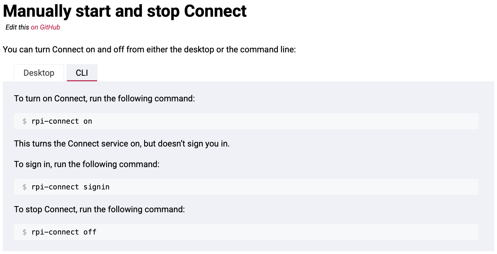

# Algorithme de reconnaissance <!-- omit in toc -->

Ce dépôt contient la partie code de l’algorithme de reconnaissance du projet **Strady**. Il est retravaillé à partir du projet de BAC III **Dartsify**.

L’objectif est d’installer cet algorithme sur une Raspberry Pi afin de détecter les fléchettes et de compter automatiquement les points.

Le projet repart actuellement de zéro sur la partie détection. Une première approche avec **UNET** a été testée, mais elle était trop lente et produisait de mauvais résultats. La nouvelle piste explorée est **YOLO**, qui devrait être mieux adaptée à la détection en temps réel sur Raspberry Pi.

Je vais opter pour YOLOv26.

## Table des matières <!-- omit in toc -->

- [Préparation du dataset DeepDarts avant entrainement](#préparation-du-dataset-deepdarts-avant-entrainement)
	- [1. Création du dataset préparé](#1-création-du-dataset-préparé)
	- [2. Nettoyage des annotations](#2-nettoyage-des-annotations)
	- [3. Vérification des labels pour une image donnée](#3-vérification-des-labels-pour-une-image-donnée)
	- [4. Conversion finale des labels au format YOLO](#4-conversion-finale-des-labels-au-format-yolo)
- [Configuration de l'entraînement](#configuration-de-lentraînement)
	- [Le fichier `data.yaml`](#le-fichier-datayaml)
	- [Le fichier `deepdarts_d1.yaml`](#le-fichier-deepdarts_d1yaml)
- [Premier entraînement (Baseline) et Suivi](#premier-entraînement-baseline-et-suivi)
- [Notes sur la Raspberry Pi](#notes-sur-la-raspberry-pi)
	- [Connexion à la Raspberry](#connexion-à-la-raspberry)
		- [Câble Ethernet Raspberry - Box WiFi](#câble-ethernet-raspberry---box-wifi)
		- [Câble Ethernet Raspberry - Ordinateur](#câble-ethernet-raspberry---ordinateur)
		- [WiFi](#wifi)
	- [Éteindre la Raspberry](#éteindre-la-raspberry)

## Préparation du dataset DeepDarts avant entrainement

> Le dataset DeepDarts doit être extrait et traité afin de correspondre aux attentes et formats de YOLO26. Je vais donc détailler dans cette section toutes les étapes nécessaires avant de lancer un entrainement. Ces étapes doivent être exécutés dans l'ordre établi.

Le dataset DeepDarts doit d’abord être extrait ([lien vers le dataset](https://ieee-dataport.org/open-access/deepdarts-dataset)) puis placé dans le dossier `datasets/deepdarts_d1/`.
Il faut conserver l’arborescence fournie par IEEE : le dossier `cropped_images/800/` contient les sous-dossiers de sessions et le fichier `labels.pkl` se trouve à la racine de `deepdarts_d1/` :

```text
datasets/
├── deepdarts_d1/
│   ├── cropped_images/
│   │   └── 800/
│   │       ├── d1_02_04_2020/
│   │       ├── d1_02_06_2020/
│   │       └── ...
│   └── labels.pkl
```

Le dossier `deepdarts_d1/` est conservé comme archive brute. Il ne faut pas y renommer ou déplacer les images, car le fichier `labels.pkl` original fait le lien entre chaque image et son dossier d’origine grâce aux colonnes `img_folder` et `img_name`.

Les étapes suivantes détaillent les différents script à exécuter dans cet ordre précis :

1. **Création du dataset préparé :** Exécuter [utils/flatten_deepdarts_images.py](utils/flatten_deepdarts_images.py) pour structurer les dossiers images/train et images/val par session.
2. **Nettoyage des annotations :** Exécuter [utils/prepare_yolo_labels.py](utils/prepare_yolo_labels.py) pour isoler les coordonnées des fléchettes et créer des boîtes normalisées de 2,5 %.
3. **Vérification (Optionnel, la vérification a déjà été faite) :** Utiliser [utils/see_labels_on_image.py](utils/see_labels_on_image.py) pour s'assurer visuellement que les boîtes encadrent bien les fléchettes.
4. **Conversion finale :** Lancer le script [utils/convert_labels.py](utils/convert_labels.py) pour générer les fichiers textes individuels exigés par l'architecture YOLO.

### 1. Création du dataset préparé

Le script [utils/flatten_deepdarts_images.py](utils/flatten_deepdarts_images.py) prépare une copie adaptée à la suite du projet :

- il lit les images depuis `deepdarts_d1/cropped_images/800/` et les annotations depuis `deepdarts_d1/labels.pkl` ;
- il crée `datasets/deepdarts_d1_yolo/` ;
- il copie les images dans `images/train/` et `images/val/` ;
- il renomme chaque image avec le nom de sa session pour éviter les doublons, par exemple `d1_02_04_2020__IMG_1081.JPG` ;
- il crée une première copie de `labels.pkl` contenant le nouveau nom de l’image et sa `bbox` ;
- il conserve le fichier original et les données brutes inchangés.

Le script doit être lancé avec l’environnement Conda du projet, `Strady_AlgoReconnaissance` :

```bash
conda run -n Strady_AlgoReconnaissance \
	python utils/flatten_deepdarts_images.py
```

(ou en exécutant le script depuis VS Code en ayant choisi le bon environnement conda en bas à droite)

Avant de faire la copie, il est possible de vérifier les opérations avec `--dry-run` :

```bash
conda run -n Strady_AlgoReconnaissance \
	python utils/flatten_deepdarts_images.py --dry-run
```

Le dossier de sortie doit être vide ou ne pas encore exister. Le script s’arrête sinon afin d’éviter d’écraser une préparation précédente.

Après exécution, l’arborescence obtenue est la suivante :

```text
datasets/
├── deepdarts_d1/                # données brutes conservées
│   ├── cropped_images/800/      # images et sessions originales
│   └── labels.pkl               # annotations originales
├── deepdarts_d1_yolo/
│   ├── images/
│   │   ├── train/               # 80 % des sessions
│   │   └── val/                 # 20 % des sessions
│   └── labels.pkl               # labels YOLO préparés
```

La séparation est faite par session complète et non image par image. Les images d’une même session sont très proches ; mettre certaines dans `train` et d’autres dans `val` donnerait une évaluation artificiellement trop optimiste. La graine utilisée par défaut est `0`, ce qui rend la séparation reproductible.

Pour le pré-entraînement sur les 15 000 images DeepDarts, aucun ensemble `test` n’est créé. Le dossier `val` sert à suivre l’entraînement et à sélectionner le meilleur modèle. Un véritable ensemble `test` sera plus pertinent lors du fine-tuning sur les images Strady : une partie de ces images devra alors être conservée à l’écart jusqu’à l’évaluation finale.

### 2. Nettoyage des annotations

De base, les données brutes de `labels.pkl` contiennent les colonnes : `img_folder`, `img_name`, `bbox` et `xy`. On va modifier tout ça pour ne garder que ce dont on a besoin.

Attention, le fichier `bbox` du dataset original ne correspond pas aux boîtes de détection dans les images `800x800` : il sert au recadrage des images originales avant leur redimensionnement. Les annotations utiles pour les fléchettes se trouvent dans la colonne `xy` du `labels.pkl` original : les quatre premiers points sont des points de calibration et les suivants sont les centres des fléchettes.

Le script [utils/prepare_yolo_labels.py](utils/prepare_yolo_labels.py) relit donc le `labels.pkl` original et remplace la copie située dans [datasets/deepdarts_d1_yolo/labels.pkl](datasets/deepdarts_d1_yolo/labels.pkl) :

- il supprime les quatre points de calibration de chaque image ;
- il conserve uniquement les points correspondant aux fléchettes ;
- il crée une boîte YOLO de classe `0` autour de chaque point (DeepDarts donnait la classe 0 aux fléchettes, et les classe 1 à 4 aux points de calibrage) ;
- il utilise une boîte de `0.025 x 0.025` en coordonnées normalisées, soit `20 x 20` pixels pour une image `800x800` (les chercheurs de DeepDarts ont utilisé des bbox de 2,5% de la résolution des images 800x800) ;
- il ignore les points pour lesquels cette boîte dépasserait les limites de l’image (à la manière encore de DeepDarts, dans `deep-darts/data-loader.py` - visible dans leur repo - on peut le voir).

La commande à lancer est :

```bash
conda run -n Strady_AlgoReconnaissance \
	python utils/prepare_yolo_labels.py
```

Après exécution, le `labels.pkl` préparé contient deux colonnes : `img_name` et `labels`. Chaque élément de `labels` suit la forme YOLO `classe, x_centre, y_centre, largeur, hauteur`, avec des coordonnées normalisées entre `0` et `1`. Le `labels.pkl` original dans `deepdarts_d1/` reste inchangé.

### 3. Vérification des labels pour une image donnée

Afin de vérifier si l'ensemble des conversions n'a pas cassé les labels, on peut vérifier avec le script [utils/see_labels_on_image.py](utils/see_labels_on_image.py) en écrivant en dur dans le code :

- le nom de l'image ;
- le tableau de labels généré par le script [utils/prepare_yolo_labels.py](utils/prepare_yolo_labels.py) (sous le format `[[classe, x_centre, y_centre, largeur, hauteur]]`).

Le script affiche l'image et montre les éventuelles bbox sur les fléchettes.

### 4. Conversion finale des labels au format YOLO

> [!WARNING] Attention
> Cette étape doit impérativement être réalisée après le nettoyage et la vérification des annotations.

YOLO ne sait pas lire les fichiers de données Python sérialisés (`.pkl`). Il exige une arborescence stricte où chaque image possède un fichier texte homonyme. Le script [convert_labels.py](convert_labels.py) se charge de cette ultime adaptation :

- il lit le fichier `labels.pkl` préalablement nettoyé ;
- il vérifie la présence de chaque image dans `images/train` ou `images/val` ;
- il génère dynamiquement les dossiers correspondants `labels/train` et `labels/val` ;
- il crée un fichier `.txt` par image avec les coordonnées au format YOLO : `classe x_centre y_centre largeur hauteur`.

## Configuration de l'entraînement

Tous les paramètres importants de l'algorithme sont centralisés dans deux fichiers distincts.

### Le fichier `data.yaml`

Il est purement informatif pour le framework YOLO. Il indique uniquement les chemins relatifs vers les dossiers d'images (`images/train` et `images/val`), le nombre de classes (`nc: 1`), et le nom de la classe ciblée (`names: ["dart"]`).

### Le fichier `deepdarts_d1.yaml`

C'est le centre de contrôle du projet. Il regroupe les hyperparamètres d'apprentissage, les paramètres du modèle (YOLOv26 Nano), les règles d'augmentation visuelle, et les chemins de sauvegarde.

> **À noter :** Les seuls paramètres qui ne figurent pas dans ce fichier de configuration sont workers, device et le caractère deterministic. Étant strictement liés à l'optimisation de l'exécution matérielle locale, ils sont écrits en dur directement dans l'appel de la fonction du script [train.py](train.py).

## Premier entraînement (Baseline) et Suivi

Pour cette première approche sur les données DeepDarts, plusieurs partis pris techniques ont été appliqués dans [train.py](train.py) et [configs/deepdarts_d1.yaml](configs/deepdarts_d1.yaml) :

- **Optimisation matérielle (Mac M1 Max) :** Le `batch_size` a été fixé à 32 pour exploiter la mémoire unifiée. Le déterminisme strict a été désactivé (`deterministic=False`) afin de contourner une limitation du backend MPS de PyTorch, évitant ainsi les crashs et accélérant les calculs.
- **Apprentissage intelligent :** Le taux d'apprentissage (Learning Rate) manuel a été retiré pour laisser le mode auto-pilote de YOLO déterminer le meilleur optimiseur. L'entraînement est configuré sur 300 epochs, couplé à un mécanisme d'Early Stopping (`patience: 50`) qui stoppe l'apprentissage si les performances de validation stagnent, empêchant le surapprentissage.
- **Augmentations visuelles :** La fonction mosaic a été désactivée (0.0) car elle détruit la cohérence globale de la cible. En revanche, une perspective de 0.001 a été ajoutée pour reproduire nativement les déformations d'angle de caméra initialement codées par DeepDarts.
- **Suivi avec Weights & Biases (WandB) :** L'entraînement est connecté à WandB via `wandb.login()` et `wandb.init()`. Cependant, le script indique à YOLO de sauvegarder les poids et les résultats de détection en local dans le dossier pointé par `name=cfg["train"]["name"]`. Par conséquent, WandB ne réceptionne que les logs et affiche les métriques système de la machine (température CPU, utilisation GPU, etc.). Pour pallier cela lors de cette première session, l'évolution de la précision (mAP) et des pertes (Loss) a été tracée manuellement via des graphiques Excel à partir du fichier results.csv généré en local.

## Notes sur la Raspberry Pi

### Connexion à la Raspberry

Afin de se connecter à la Raspberry, nous pouvons :

- brancher un câble Ethernet dans le port Ethernet de la Raspberry afin d’assurer une connexion directe entre la box WiFi et la Raspberry ;
- brancher un câble Ethernet afin d’assurer une connexion entre un ordinateur personnel et la Raspberry ;
- connecter la Raspberry au WiFi sans fil.

#### Câble Ethernet Raspberry - Box WiFi

Cette solution est la plus simple mais nous ne pouvons pas l’utiliser pour la présentation du projet, car nous n’aurons pas accès à un port Ethernet fournissant une connexion dans le local où nous présenterons.

#### Câble Ethernet Raspberry - Ordinateur

Cette solution nous permet de nous rendre indépendants d’une connexion filaire avec un port Ethernet délivrant la connexion réseau.
Après la configuration du partage réseau et la connexion de l’ordinateur au réseau WiFi, la Raspberry peut recevoir la connexion via l’ordinateur.

Afin de se connecter à la Raspberry, il faut déterminer son adresse IP. Pour ceci, j’ai exécuté `arp -a -i bridge100`. Cette commande interroge la table ARP en filtrant spécifiquement sur l’interface réseau appelée `bridge100`. Grâce au retour de cette commande, nous pouvons voir quelque chose comme `? (192.168.2.2) at 2c:cf:67:db:6d:c2 on bridge100 ifscope [bridge]`. Ainsi, l’adresse IP de la Raspberry s’avère être `192.168.2.2`. Sur base de cette adresse, nous pouvons nous connecter via SSH dans le terminal : `ssh raspberry@192.168.2.2`.

Cependant, cette solution présente le problème qu’un câble sera apparent entre la Raspberry et l’ordinateur faisant tourner le site web. Cela peut donner l’impression que la solution n’est pas totalement sans fil, alors qu’elle fonctionne bien en pratique dans une logique 100 % sans fil pour la partie reconnaissance.

> N.B. : il serait aussi possible, dans ce cas, de récupérer les données de la base de données via l’API sans dépendre d’une connexion sans fil.

#### WiFi

Pour être totalement sans fil, nous pouvons connecter la Raspberry au WiFi sans fil. Deux choix s’offrent à nous :

- utiliser la carte SD et le logiciel Raspberry Pi Imager : en configurant la carte SD de manière appropriée, avec le nom du réseau et le mot de passe, la Raspberry se connecte au réseau lors du démarrage ;
- utiliser l’interface graphique : en branchant d’abord un câble Ethernet entre la Raspberry et l’ordinateur personnel pour lui fournir une connexion, puis en passant par Raspberry Pi Connect, on peut accéder à l’interface graphique de la Raspberry et renseigner les paramètres WiFi.

[Documentation officielle](https://www.raspberrypi.com/documentation/services/connect.html)



> N.B. : la connexion est coupée momentanément lors du changement de réseau, mais on peut ensuite revenir via le portail ou via SSH.

### Éteindre la Raspberry

Il ne faut pas juste débrancher le câble. Il vaut mieux exécuter `sudo shutdown -h now`. Débrancher directement peut endommager la carte SD ou provoquer une corruption du système de fichiers.
