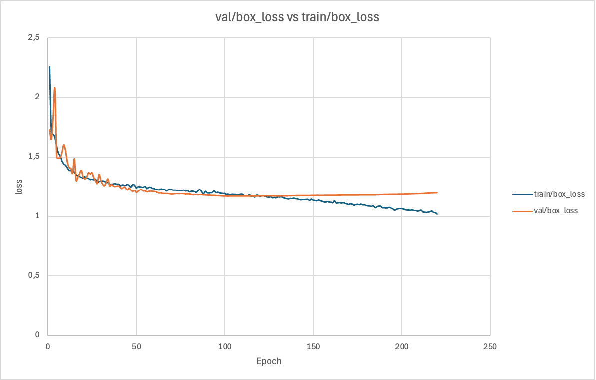
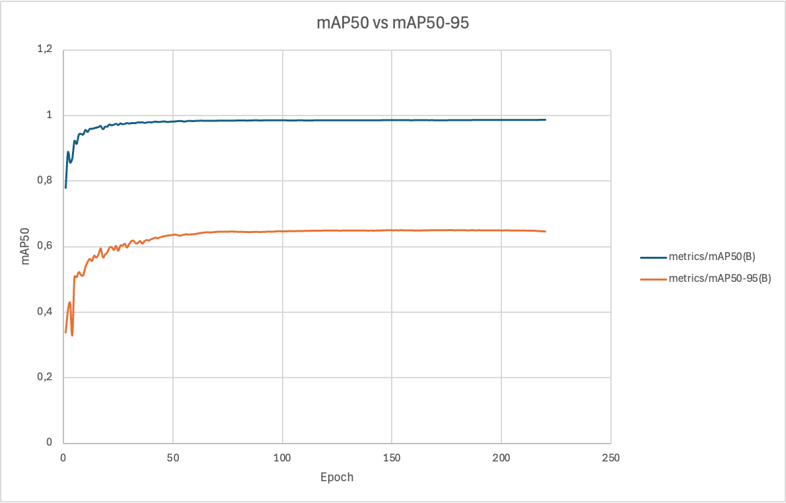
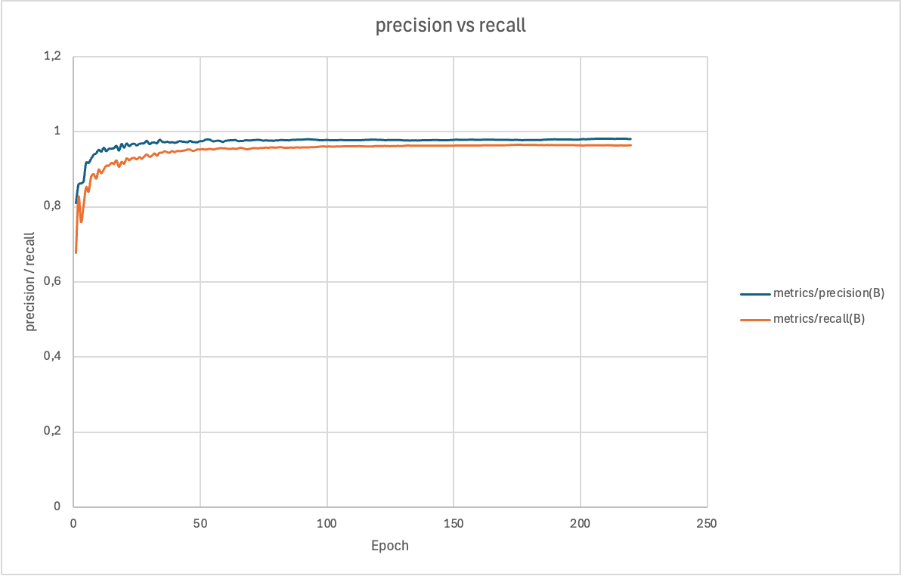
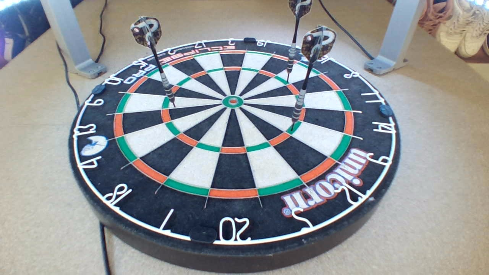

# Notes sur l'entrainement du modèle <!-- omit in toc -->

## Table des matières <!-- omit in toc -->

- [`25-sept-2026`](#25-sept-2026)
- [`26-sept-2026`](#26-sept-2026)
- [`27-sept-2026 (a)`](#27-sept-2026-a)
- [`27-sept-2026 (b)`](#27-sept-2026-b)
- [`28-sept-2026`](#28-sept-2026)
- [`06-oct-2026`](#06-oct-2026)
- [`07-oct-2026`](#07-oct-2026)

## `25-sept-2026`

Je vois dans un guide de bonnes pratiques d'ultralytics ([lien](https://docs.ultralytics.com/guides/model-training-tips)) qu'un bon début est de paramétrer 300 epochs et de voir si ça overfit. Je vais peut-être faire pareil.

Par défaut apparement YOLO26 utilise les poids de COCO. Donc pas besoin d'utiliser les poids d'ImageNet comme c'était courant à l'époque.

Je viens de découvrir qu'il faut plutôt, pour le format YOLO, un fichier `.txt` d'annotation par image. Donc je vais faire un script qui traduit le `labels.pkl` de DeepDarts dans le bon format.

Je me demandais aussi pq on doit pas utiliser de DataLoaders avec pytoch etc comme aux TPs, ici tout est fait tout seul. Pas besoin de s'occuper de ça.

## `26-sept-2026`

Pendant l'entrainement sur deepdarts, je vois que toutes les métriques sont bonnes :

- Précision (0.977) ;
- Rappel / Recall (0.962) ;
- mAP50 (0.984) ;
- mAP50-95 (0.648).

Cependant on voit que mAP50-95 est pas top : ça signifie que le modèle est pas hyper précis sur le tracé de la bbox autour de l'impact. Ça voudrait donc dire que l'estimation du score sera pas méga précise (il risque de décaller un peu trop la bbox par rapport à ce qu'il devrait faire). Apparement un YOLO Pose résoudrait ce problème car il est plus fait pour les points, MAIS il est plus lourd et donc l'inférence sera possiblement plus lente sur raspberry.

Donc je propose :

- On continue l'entrainement et le transfer learning de ce modèle Tiny sur notre dataset et voir ce que ça donne (niveau temps, précision etc surtout sur Raspberry) ;
- Lancer en simultané un second entrainement d'un Pose et faire aussi ce transfer learning dessus et comparer (le temmps etc) ;
- On peut aussi tenter de donner plus d'importance au bon placement des bbox via la pondération de la fonction de perte (lors du transfer, décider de opti plutôt la box_loss que la cls_loss).

## `27-sept-2026 (a)`

Fin d'entrainement. Je pensais qu'il allait prendre le best vers 120, mais par peur de tout faire buguer je ne l'ai pas coupé à la main, je voulais qu'il se coupe tout seul.
Cependant, je vois ce matin qu'il ne s'est jamais coupé et qu'il était à l'epoch 221... Après vérification, il a effectivement pris l'epoch 175 comme meilleure même si selon le graphique elle est clairement moins bonne (le framework utilise une fonction qui prend en compte différentes métriques, donc il juge que le modèle était meilleur à l'epoch 175 qu'à l'epoch 120 malgré la remontée de la val_box - askip il se base aussi sur les mAP).

| epoch | time    | train/box_loss | train/cls_loss | train/l1_loss | metrics/precision (B) | metrics/recall(B) | metrics/mAP50(B) | metrics/mAP50-95(B) | val/box_loss | val/cls_loss | val/l1_loss | lr/pg0   | lr/pg1   | lr/pg2   | lr/pg3   | lr/pg4   | lr/pg5   | lr/pg6   | lr/pg7   |
| :---- | :------ | :------------- | -------------- | ------------- | --------------------- | ----------------- | ---------------- | ------------------- | ------------ | ------------ | ----------- | -------- | -------- | -------- | -------- | -------- | -------- | -------- | -------- |
| 120   | 75353,9 | 1,16603        | 0,49774        | 0,00195       | 0,97804               | 0,96269           | 0,98447          | 0,64908             | 1,17285      | 0,43119      | 0,00159     | 0,018219 | 0,006073 | 0,018219 | 0,006073 | 0,018219 | 0,006073 | 0,018219 | 0,006073 |
| 125   | 78493,2 | 1,1595         | 0,49045        | 0,00193       | 0,97738               | 0,96235           | 0,98454          | 0,64903             | 1,17325      | 0,42826      | 0,00159     | 0,017724 | 0,005908 | 0,017724 | 0,005908 | 0,017724 | 0,005908 | 0,017724 | 0,005908 |
| 129   | 81003,2 | 1,15323        | 0,50392        | 0,00193       | 0,97731               | 0,96269           | 0,98458          | 0,6492              | 1,17204      | 0,42951      | 0,00159     | 0,017328 | 0,005776 | 0,017328 | 0,005776 | 0,017328 | 0,005776 | 0,017328 | 0,005776 |
| 175   | 109981  | 1,09955        | 0,46215        | 0,00182       | 0,97768               | 0,96616           | 0,98491          | 0,6501              | 1,18098      | 0,41821      | 0,0016      | 0,012774 | 0,004258 | 0,012774 | 0,004258 | 0,012774 | 0,004258 | 0,012774 | 0,004258 |

 

<b>Notes de Gemini sur le choix de l'epoch 175 plutôt qu'une aux alentours de la 120</b>

> La mAP50-95 (Mean Average Precision) dépend effectivement du bon placement de tes boîtes. Elle se base sur l'IoU (Intersection over Union), qui calcule le pourcentage de chevauchement parfait entre la boîte prédite par ton modèle et la boîte réelle. Le "50-95" signifie que l'algorithme est de plus en plus exigeant sur cette précision géographique, jusqu'à demander 95% de chevauchement.
>
> Alors comment la mAP50-95 peut-elle monter (amélioration) pendant que la val/box_loss monte aussi (dégradation) ?
>
> Voici ce qu'il se passe sous le capot entre l'époque 125 et 175 :
>
> - **Le poids de la confiance (cls_loss) :** La mAP ne regarde pas uniquement la géométrie pure, elle classe les prédictions selon la certitude du modèle. À l'époque 175, la perte de classification (val/cls_loss) a fortement baissé (de 0.428 à 0.418). Le modèle identifie les cibles avec beaucoup plus d'assurance. Ses meilleures prédictions remontent en haut du classement, ce qui fait mathématiquement grimper le score mAP global, même si les boîtes ont très légèrement bougé.
> - **Les seuils vs l'erreur brute :** La box_loss calcule la distance absolue d'erreur au pixel près sur l'ensemble de l'image. Si le modèle décale ses boîtes d'une fraction de millimètre supplémentaire par rapport à l'époque 120, la box_loss se dégrade. Cependant, si ce micro-décalage maintient tout de même le chevauchement (IoU) au-dessus du seuil requis (par exemple 80% ou 90%), la mAP ne pénalisera pas la détection.
>
> En résumé, à l'époque 175, le modèle est infiniment moins "parfait" au pixel près sur le tracé de la boîte (box_loss plus haute), mais il se trompe beaucoup moins sur l'identification de ce qu'il encadre (cls_loss plus basse). Le compromis calculé par la fonction de fitness estime que cette solidité de détection est préférable à la perfection du contour, d'où ce choix final.

 

Ensuite, j'ai testé sur des images issues d'internet. Évidemment, y'a tellement de conditions différentes que les résultats sont pas dingues. Néanmoins, niveau temps ça semble relativement rapide : sur mon mac je suis à 11.5ms pour l'inférence, 108.6ms pour le preprocess et 8.9ms pour le postprocess. On verra ce que ça donne sur la Raspberry mais c'est prometteur.

## `27-sept-2026 (b)`

Je viens de me rendre compte que j'avais mis ensemble de dataset d1 et le d2 en pendant n'avoir gardé que le d1 de DeepDarts. Cela veut dire que j'ai entrainé le modèle YOLO directement avec leur deux dataset en une fois (eux avaient d'abord entrainé sur le premier, puis avaient fait un transfer vers le deuxième). Je ne sais pas si c'est fondamentalement mauvais ou si pour une première étape c'est pas grave.

Réponse de l'ia : c'est relativement grave. Pq ? Car étant donné le nombre très différent d'image dans chaque dataset, le modèle va plutôt prioriser les angles de vue de face (15k photos contre 1k).

Mais alors, vaut-il mieux utiliser le d1 ou le d2 ? D'après elle, utiliser le d1 est très intéressant surtout grâce à sa taille massive (le modèle apprend grâce à lui ce qu'est une cible, une fléchette et comment la lumière interagit avec les objets).

Une question que je me suis posée avant d'avoir cette réponse : pourquoi les auteurs de DeepDarts ont utilisé ce transfer learning plutôt que d'avoir tout foutu ensemble d'un coup ? C'était justement pour voir si l'apprentissage massif sur base du d1 de face pouvait être utile à l'apprentissage sur une nouvelle cible présentant des angles de caméra différents tout en ayant peu de données (15 fois moins). Ils ont prouvé qu'effectivement le transfer learning a boosté les compétences du réseau final (exploitant d1 et d2) plutôt qu'un autre ayant juste été entrainé sur le d2.

Dès lors, pouvons nous par exemple adopter une méthode `train sur d1 -> train sur d2 -> train sur notre dataset` ou devons nous remplacer totalement le d2 avec nos images ?

D'après l'ia, exploiter d2 entre d1 et notre dataset serait une perte de temps

<b>Notes sur la vue de nos caméras vs celles de DeepDarts, notamment est-ce pas grave que l'on ne voit pas l'ensemble de la flèche sur les vues des caméras opposées ?</b>

> Les fléchettes vues sur nos images ne sont pas entières quand elles sont sur le côté opposé de la caméra.
>
> Donc question : est ce que ça dérange Yolo de ne pas voir cette fléchette en entier et que donc cette partie en moins l’handicape dans sa recherche.
>
> D’après l’ia : oui. Mais si on l’entraîne avec nos images, il va apprendre que des flèches sont entières et d’autres non, donc sans doutes que les fléchettes entières auront un meilleur score de confiance que les fléchettes avec une partie en moins.
>
> Cependant, je viens de me dire : les bbox annotées dans le dataset de deepdarts n’entourent pas l’ensemble de la fléchette avec un point sur la flèche : c’est uniquement un carré centré sur sur la pointe.
>
> Donc question : est ce que Yolo sous le capot fait quand même un lien entre la pointe de la flèche et le haut même si la bbox n’entoure pas la flèche en entier ?
>
> D’après l’ia : non. Donc Yolo est uniquement entraîné à entraîner à trouver la pointe d’une fléchette plantée dans la cible.
>
> Donc question : doit on se réjouir en se disant que du coup sur nos images, ne pas voir l’entier d’une fléchette au bout est pas grave du tout (vu que tout ce qui l’intéresse est la pointe de la flèche) OU justement doit on s’inquiéter que Yolo n’exploite pas toutes les données à sa disposition (ça pourrait être plus précis qu’il s’aide de la tête et de la pointe en entier) ??
>
> Une chose est sûre : il faut uniformiser les notations. Si deepdarts annote une bbox carrée centrée sur la pointe, il faut faire pareil.
>
> → Bon finalement il me dit que si, il se base sur le contexte : l’ailette lui sert de panneau indicateur pour lui MAIS justement, il a besoin de toujours voir la fléchette en entier. Donc il faut aussi l’entraîner avec des fléchettes pas entièrement visibles (c’est ce qu’on aura sur notre dataset).
>
> Utiliser Yolo Pose semble top aussi, mais ça veut dire essayer de trouver un script pour traduire les annotation de deepdarts en annotation Yolo Pose car il faut encadrer la fléchette, placer un point de repère sur la pointe (et si on veut un autre point comme un point sur le haut du corps métallique pour pouvoir avoir un vecteur de l’orientation de la fléchette).

 

<b>Update sur l'entrainement du modèle Pose</b>

> On ne saura pas entrainer ce modèle sur le dataset de DeepDarts, du moins le d1.
>
> On pourrait en soi l'appliquer au dataset d2 et dès lors complètement dégager le d1, mais c'est pas hyper logique car :
>
> - on doit quand même réannoter les images (à moins de définir un script qui change lui même les labels, mais il ne saura pas tracer une bbox précise autour de la fléchette uniquement sur base de la pointe de la flèche, cette info. dépend de l'angle de la fléchette qui n'est pas connu) ;
> - donc, si on le fait à la main, autant annoter des images issues de notre propre dataset (passer notre dataset de x à y images avec y > x plutôt que d'exploiter ce dataset).

 

> **Je dois donc plutôt envisager ces deux situations** :
>
> - Garder ce modèle actuel et tenter le transfer learning sur notre dataset ;
> - Ré-entrainer le YOLO26 Tiny avec uniquement le dataset d1 (et procéder au transfer et comparer les deux modèles finaux, celui avec la pollution du d2 et celui sans) ;
> - Entrainer un YOLO Pose avec uniquement nos images (on exploite plus du tout dès lors le dataset de DeepDarts).

## `28-sept-2026`

Je me suis dit : de base on donne l'image en entier vue par chacune des caméras. Cependant, comme on peut le voir sur cette image :

Les éléments extérieurs (ici les chaussures) sont visibles. Je pense que ça n'a pas de sens d'entrainer YOLO avec ça et de lui donner ces parties de l'image durant la phase d'inférence. Donc je me dis : il faudrait que lorsque les caméras "prennent" les 3 photos, on redimensionne direct pour dégager les côtés inutiles.

De là, l'IA me dit que ce serait même mieux de tenter d'extraire un carré (c'est déjà le ratio utilisé par le dataset deepdarts d1) et d'également appliquer l'homographie sur l'image afin de la recentrer. Ça permettrait d'entrainer YOLO sur un dataset plus ressemblant à ce qu'il a déjà vu dans le dataset d1.

Donc je me demande également si au moment de l'annotation, il faut annoter les images déjà carrées et centrées ?

Même question si on veut tester l'entrainement d'un YOLO Pose -> étant donné qu'il n'a pas strictement la même convention d'annotation que pour le YOLO classique, comment faire ?

L'IA me conseilles de directement annoter pour YOLO Pose et de dégager après à l'aide d'un script les données liées uniquement à Pose si je veux utiliser ce dataset sur un YOLO classique. Encore d'après elle, si on annote sur le dataset brut (sans centrage) via Keypoints, on pourra avec un script simplement transposer les coordonnées de la pointe de la flèche (déjà renseigné lors de l'annotation) et ce sera parfaitement précis. Ensuite, si on veut vraiment avoir une bbox comme dans le dataset d1, on aura qu'à générer une bbox de taille constante centrée en ce point.

-> Dès lors, tout nous mène à annoter via la convention Keypoints plutôt que de la simple Object Detection.

## `06-oct-2026`

Lancement du premier transfer learning. J'ai utilisé la config. [configs/strady_deepdarts_1.yaml](configs/strady_deepdarts_1.yaml). Je le fais donc tourner sur uniquement 1157 images de David (sur 1500), c'est histoire d'avoir déjà un truc à tester. Je n'ai pas activé le freeze de certaines couches et j'ai laissé les mêmes paramètres pour la data augmentation.

Je propose, pour les run suivant de tester :

- La désactivation de la data augmentation ;
- Le freeze de certaines couches ;
- Le non transfer des poids pré-établis de la dernière couche (apparemment DeepDarts n'a pas repris les poids du pré-entrainement de la dernière couche) ;
- L'entrainement sans pré-entrainement pour voir si DeepDarts nous aide vraiment.

J'ai ensuite lancé un entrainement sans data aug. (mais c'est bizarre, on dirait dans le batch au début qu'il y a quand même une modif de type scale, voir photo).

## `07-oct-2026`

Liste des entrainements de transfer learning :

1. [runs/detect/strady_yolo/strady_yolo_run/](runs/detect/strady_yolo/strady_yolo_run/) : 1157 images de David, poids de DeepDarts, data aug. ([configs/strady_deepdarts_1.yaml](configs/strady_deepdarts_1.yaml)) ;
2. [runs/detect/strady/strady_yolo_run/](runs/detect/strady/strady_yolo_run/) : 1157 images de David, poids de DeepDarts, pas de data aug. (sauf scale) ([configs/strady_deepdarts_2.yaml](configs/strady_deepdarts_2.yaml)) ;
3. [runs/detect/strady/strady_yolo_run-2/](runs/detect/strady/strady_yolo_run-2/) : 1157 images de David, pas de poids de base, pas de data aug. ([configs/strady_deepdarts_3.yaml](configs/strady_deepdarts_3.yaml)) ;
4. [runs/detect/strady/strady_yolo_run-3/](runs/detect/strady/strady_yolo_run-3/) : 1157 images de David, poids de DeepDarts, pas de data aug. ([configs/strady_deepdarts_4.yaml](configs/strady_deepdarts_4.yaml)) ;

Pour le moment, l'entrainement 2 a l'air le mieux ! Je me demandais, pourquoi le scale permet des meilleurs résultats ?

> Note de l'ia :
> L'augmentation scale (qui simule un zoom avant ou arrière aléatoire sur l'image) est particulièrement efficace pour ton projet pour trois raisons précises :
> Lutte contre le surapprentissage de la taille : Sans aucune augmentation (entraînement 4), le réseau neuronal mémorise la taille exacte (en pixels) de tes fléchettes. Le scale force le modèle à se concentrer sur les caractéristiques visuelles de la fléchette (la pointe, le corps, l'ailette) plutôt que sur un gabarit figé.
> Gestion de la perspective : Même si ta caméra est fixe, une fléchette plantée au centre de la cible n'aura pas exactement la même taille apparente (ni la même déformation due à la lentille) qu'une fléchette plantée sur un bord extrême. Le scale simule ces légères variations de taille et rend la prédiction des bounding boxes beaucoup plus robuste.
> Le juste milieu (Sweet spot) : L'entraînement 1 (toutes augmentations activées) modifiait probablement trop les images (rotations, couleurs, mosaïques), ce qui brouillait les repères. L'entraînement 4 (aucune augmentation) causait un surapprentissage immédiat. L'entraînement 2, en n'utilisant que le scale, apporte juste assez de variation pour forcer le modèle à généraliser, sans dénaturer la géométrie de ta cible.

Suite des entrainements :

5. [runs/detect/strady/strady_yolo_run-4/](runs/detect/strady/strady_yolo_run-4/) : 1157 images de David, poids de DeepDarts, pas de data aug. (sauf scale), freeze 10 ([configs/strady_deepdarts_5.yaml](configs/strady_deepdarts_5.yaml)) ;
6. [runs/detect/strady/strady_yolo_run-5/](runs/detect/strady/strady_yolo_run-5/) : 1157 images de David, poids de DeepDarts, pas de data aug. (sauf scale), freeze 11 ([configs/strady_deepdarts_6.yaml](configs/strady_deepdarts_6.yaml)) ;
